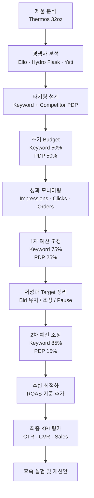

# Amazon Sponsored Ads — 캠페인 최적화 및 예산 배분


Amazon Sponsored Ads를 활용해 **Thermos 32oz 보온·보냉 물병의 검색 키워드 및 경쟁사 상품 페이지 광고를 운영하고, 실제 캠페인 성과에 따라 예산과 입찰 전략을 조정한 퍼포먼스 마케팅 프로젝트**입니다.

초기에는 Keyword Targeting과 경쟁사 PDP(Product Detail Page) Targeting에 동일한 예산을 배분했습니다. 이후 실제 주문 데이터를 확인하면서 Keyword Campaign의 예산 비중을 단계적으로 확대했고, 캠페인 후반에는 ROAS까지 입찰 판단 기준에 포함했습니다.

최종적으로 CTR 목표는 달성했지만 CVR과 매출 목표는 달성하지 못했습니다. 따라서 결과를 성공으로 포장하기보다 **어떤 전략이 작동했고, 어디에서 전환이 막혔으며, 다음 캠페인에서 무엇을 검증해야 하는지**까지 정리했습니다.

> **팀 프로젝트 — 5인 공동 수행**
>
> 팀원별로 업무를 고정 분담하기보다 제품 및 경쟁사 조사, 타기팅 설계, 캠페인 운영, 주차별 성과 분석, 예산·입찰 조정, 최종 개선안 도출까지 전 과정에 함께 참여했습니다.

---

## 1. 프로젝트 요약

| 항목 | 내용 |
|---|---|
| **문제** | 제한된 광고 예산을 Keyword와 경쟁사 PDP 중 어디에 배분해야 제품 노출과 매출을 효율적으로 확보할 수 있는가 |
| **제품** | Thermos ICON Series Stainless Steel Water Bottle — 32oz, Granite |
| **광고 채널** | Amazon Sponsored Ads |
| **초기 목표** | Product Visibility 및 Sales 확대 |
| **KPI** | CTR ≥ 0.5%, CVR ≥ 10%, Sales $1,350 |
| **초기 전략** | Keyword Targeting 50% / PDP Targeting 50% |
| **타기팅** | 경쟁 브랜드 Keyword + 경쟁사 Product Detail Page |
| **주요 경쟁사** | Ello, Hydro Flask, Yeti |
| **최종 결과** | 686,424 Impressions · 896 Clicks · 41 Conversions · CTR 0.7% · CVR 4.5% · Sales $1,087 |
| **핵심 의사결정** | Keyword Campaign이 PDP보다 더 많은 주문을 만들자 예산 비중을 단계적으로 확대 |
| **운영 기준** | Impressions, Clicks, Orders, CTR, CVR, Sales, ROAS |
| **결론** | Traffic 확보에는 성과가 있었지만 Conversion과 Sales는 목표 미달. 후속 과제는 유입 확대보다 구매 전환 개선 |

### 핵심 결과

- **Impressions:** 686,424
- **Clicks:** 896
- **Conversions:** 41
- **CTR:** **0.7%**
- **CVR:** **4.5%**
- **Sales:** **$1,087**
- 초기 Budget: **Keyword 50% / PDP 50%**
- Keyword의 주문 우위를 확인한 뒤 **75:25 → 85:15** 등으로 예산 조정
- 가장 많은 주문을 기록한 Keyword:
  - `Yeti water bottles` — 20 orders
  - `Hydro flask water bottles` — 6 orders
  - `Ello insulated water bottle` — 3 orders

> 특정 Match Type, 가격 또는 제품 속성이 성과 차이의 직접적인 원인이었다고 단정하지 않았습니다.  
> 본 프로젝트에서 관측된 결과와 추가 검증이 필요한 가설을 구분해 해석했습니다.

---

## 2. 분석 질문

프로젝트는 세 가지 질문에서 시작했습니다.

### Q1. 어떤 경쟁사를 대상으로 광고할 것인가?

제품 특성과 가격대를 비교해 주요 경쟁 브랜드를 선정하고, 해당 브랜드를 검색하거나 경쟁 제품의 상세 페이지를 보고 있는 고객에게 Thermos 제품을 노출하고자 했습니다.

### Q2. Keyword와 PDP 중 어디에 예산을 더 배분해야 하는가?

처음부터 한쪽이 더 효과적이라고 가정하지 않고 동일한 예산으로 시작한 뒤 실제:

- Impressions
- Clicks
- Orders
- Sales
- ROAS

를 비교해 예산을 조정하기로 했습니다.

### Q3. 캠페인 목표를 실제로 달성했는가?

광고가 많이 노출되거나 클릭된 것만으로 성공이라고 판단하지 않고, 캠페인 시작 전에 설정한 CTR·CVR·Sales KPI와 최종 결과를 비교했습니다.

---

## 3. 캠페인 흐름



---

## 4. 제품 및 경쟁 환경

### Target Product

**Thermos ICON Series Stainless Steel Water Bottle**

- 32 oz
- Granite
- Insulated
- Screw-top lid
- Wide-mouth opening
- Hot: 약 14시간
- Cold: 약 24시간
- 판매가: **$29.99**

제품 특성과 시장 내 포지션을 바탕으로 다음 세 브랜드를 주요 경쟁 대상으로 선정했습니다.

### Competitors

| Brand | 주요 특징 |
|---|---|
| **Hydro Flask** | 다양한 용량과 색상, 높은 브랜드 인지도 |
| **Ello** | 비슷한 가격대와 다양한 디자인 |
| **Yeti** | Premium 가격대와 강한 브랜드 인지도 |

초기 경쟁사 목록에는 Stanley를 포함하지 않았습니다.

캠페인 종료 후에는 Stanley 역시 직접 경쟁 대상으로 테스트했어야 한다는 점을 개선사항으로 남겼습니다.

---

## 5. 초기 KPI

캠페인 시작 전에 다음 KPI를 설정했습니다.

| KPI | 목표 |
|---|---:|
| **CTR** | ≥ 0.5% |
| **CVR** | ≥ 10.0% |
| **Sales** | $1,350 |
| **Business Goal** | Visibility 및 Sales 확대 |

KPI를 사전에 설정해 캠페인 종료 후 결과에 맞춰 성공 기준을 바꾸지 않도록 했습니다.

---

## 6. 초기 타기팅 전략

광고 전략은 크게 두 가지로 나눴습니다.

### Keyword Targeting

경쟁 브랜드와 제품 특성을 기반으로 검색 Keyword를 선정했습니다.

예:

```text
Ello water bottles
Ello insulated water bottle
Hydro Flask water bottles
Hydro Flask insulated water bottle
Yeti water bottles
Yeti insulated water bottles
```

### PDP Targeting

경쟁사 Amazon Product Detail Page에 Thermos 제품 광고를 노출하도록 설정했습니다.

주요 대상 브랜드:

- Ello
- Hydro Flask
- Yeti

초기에는 총 **15개 경쟁사 ASIN**을 대상으로 설정했습니다.

### 초기 Budget Allocation

```text
Keyword Targeting   50% = $25/day
PDP Targeting       50% = $25/day
```

Keyword와 PDP 중 어느 쪽이 더 효과적인지 사전에 확신할 수 없었기 때문에 동일한 예산으로 시작했습니다.

---

## 7. 최종 캠페인 결과

| Metric | 결과 | 목표 | 평가 |
|---|---:|---:|---|
| **Impressions** | 686,424 | — | — |
| **Clicks** | 896 | — | — |
| **Conversions** | 41 | — | — |
| **CTR** | **0.7%** | ≥ 0.5% | 달성 |
| **CVR** | **4.5%** | ≥ 10.0% | 미달 |
| **Sales** | **$1,087** | $1,350 | 미달 |

### KPI 평가

**CTR**

```text
Target ≥ 0.5%
Actual = 0.7%
```

광고 노출 이후 Click을 확보하는 단계에서는 목표를 달성했습니다.

반면:

**CVR**

```text
Target ≥ 10.0%
Actual = 4.5%
```

**Sales**

```text
Target = $1,350
Actual = $1,087
```

로 목표에 미달했습니다.

따라서 캠페인의 최종 결과는:

> **제품 Visibility 확대에는 일정 성과가 있었지만, 확보된 Traffic을 구매로 전환하는 단계에서는 개선이 필요했습니다.**

### 시각화

```markdown

```

---

## 8. 캠페인 중 예산을 어떻게 바꿨는가

초기 Budget은:

```text
Keyword  50%
PDP      50%
```

였습니다.

그러나 초기 성과에서 Keyword Campaign이 PDP보다 더 많은 주문을 만들었습니다.

첫 번째 Optimization 시점에는 주문이:

```text
Keyword   5
PDP       0
```

으로 나타났습니다.

이에 따라 Budget을:

```text
Keyword  75%
PDP      25%
```

로 조정했습니다.

다음 성과 확인 시점에서도 Keyword의 주문 우위가 이어졌습니다.

```text
Keyword  11
PDP       1
```

Budget은 다시:

```text
Keyword  85%
PDP      15%
```

로 조정했습니다.

후반부 성과에서도:

```text
Keyword  23
PDP       5
```

로 Keyword의 주문 기여가 더 크게 나타났습니다.

다만 PDP에서도 주문이 발생하기 시작했기 때문에 완전히 중단하지 않고 일정 예산을 유지했습니다.

### 시각화

```markdown

```

> 각 숫자는 캠페인 운영 과정의 성과 확인 시점에 보고된 값이며, 서로 단순 합산하지 않았습니다.

---

## 9. 입찰 기준도 함께 바꿨습니다

초기에는 주로 Impression, Click, Order 여부를 기준으로 Bid를 조정했습니다.

### 초기 운영 기준

**Impression → Click → Order 발생**

→ Bid 확대 검토

**Impression은 있으나 Click 없음**

→ Median Suggested Bid 검토

**노출 자체가 없음**

→ 기존 Bid 유지 또는 Target 재검토

캠페인이 진행되면서 단순 주문 여부만 보는 방식에서 벗어나 **ROAS를 추가 판단 기준으로 사용**했습니다.

### 후반 운영 기준

```text
ROAS > 1
→ Bid 확대 검토

ROAS < 1
→ Current Bid

No ROAS
→ Current Bid / 추가 관찰
```

즉 캠페인 운영 기준도:

```text
노출
→ 클릭
→ 주문
→ 매출 대비 광고 효율
```

순으로 발전시켰습니다.

---

## 10. Keyword 성과

가장 많은 주문을 기록한 Keyword는 다음과 같았습니다.

| Keyword | Orders |
|---|---:|
| **Yeti water bottles** | **20** |
| **Hydro flask water bottles** | **6** |
| **Ello insulated water bottle** | **3** |

반대로 다음 Keyword에서는 주문이 발생하지 않았습니다.

```text
Ello gray water bottle
Hydro flask wide mouth
Yeti screw top
```

초기 발표에서는 상위 Keyword들이 Exact Match였고, 일부 저성과 Keyword들이 Phrase Match였다는 점을 관찰했습니다.

다만 이것만으로:

> Exact Match가 더 높은 주문을 만들었다

고 인과적으로 해석할 수는 없습니다.

동시에 다음 요소들도 달랐기 때문입니다.

- Brand Search Demand
- Search Intent
- Keyword Specificity
- Bid
- Competition

따라서 본 README에서는:

> **본 캠페인에서 Exact Match Keyword가 상대적으로 높은 주문을 기록했다**

는 관측 결과까지만 보고하고, Match Type 자체의 효과는 별도 실험이 필요한 가설로 남겼습니다.

### 시각화

```markdown

```

---

## 11. PDP 성과

가장 많은 주문을 기록한 경쟁사 PDP는:

### YETI Rambler 26oz

```text
ASIN: B0842S56G8
Orders: 6
```

그 외 일부 Hydro Flask PDP에서도 주문이 발생했지만 여러 Target에서는 주문이 없었습니다.

초기 분석에서는 우리 제품보다 가격이 높은 경쟁 제품 PDP에서 주문이 발생했다는 점을 관찰했습니다.

그러나 다음 변수들이 함께 달랐습니다.

- Brand
- Price
- Rating
- Review Count
- Color
- Product Design
- Capacity

따라서:

> **가격이 높기 때문에 경쟁사 PDP Targeting이 성공했다**

고 단정하지 않았습니다.

대신 후속 캠페인에서:

```text
유사 가격대 경쟁 제품
vs.
Premium 가격대 경쟁 제품
```

을 별도로 구성해 검증할 가설로 남겼습니다.

### 시각화

```markdown

```

---

## 12. 무엇이 작동했고 무엇이 작동하지 않았는가

### 작동한 부분

#### 1. Keyword Targeting

캠페인 운영 과정에서 PDP보다 지속적으로 많은 주문을 기록했습니다.

#### 2. 경쟁 브랜드 검색어

Yeti, Hydro Flask, Ello 관련 검색어에서 실제 주문이 발생했습니다.

#### 3. 성과 기반 예산 이동

처음 설정한 50:50 Budget을 고정하지 않고 실제 주문 데이터를 보고 Keyword 쪽으로 예산을 이동했습니다.

#### 4. 운영 기준의 발전

초기에는 노출·클릭·주문을 중심으로 판단했지만 캠페인 후반에는 ROAS를 추가했습니다.

### 기대보다 약했던 부분

#### 1. PDP Targeting

초기 기대보다 주문 기여도가 낮았습니다.

#### 2. Conversion Rate

CTR은 목표를 달성했지만 CVR은:

```text
Target  10.0%
Actual   4.5%
```

에 머물렀습니다.

#### 3. Sales

```text
Target  $1,350
Actual  $1,087
```

로 목표에 도달하지 못했습니다.

따라서 후속 캠페인의 가장 큰 과제는:

> **더 많은 Traffic 확보보다 이미 확보한 Traffic을 구매로 전환하는 것**

이라고 판단했습니다.

---

## 13. 최종 실행안

### ① 성과가 확인된 Keyword 유지

주문을 실제로 기록한 경쟁 브랜드 Keyword를 우선 유지합니다.

```text
Yeti water bottles
Hydro flask water bottles
Ello insulated water bottle
```

### ② Keyword별 ROAS 기준 운영

단순 Impression이나 Click보다:

```text
Spend
Sales
Orders
ROAS
```

를 함께 보고 Bid를 조정합니다.

### ③ 저성과 Target 정리

충분한 Impression 또는 Click이 누적됐지만 주문이 발생하지 않는 Target은 Budget을 줄이거나 Pause합니다.

### ④ PDP Budget은 유지하되 선택적으로 운영

PDP가 Keyword보다 전반적으로 약했지만 일부 Yeti PDP에서는 주문이 발생했습니다.

따라서 PDP 전체를 중단하기보다 성과가 확인된 Product Page 중심으로 좁힙니다.

### ⑤ Stanley 경쟁사 Test 추가

초기 타기팅에서 빠졌던 Stanley를 후속 캠페인의 경쟁사 후보로 추가합니다.

### ⑥ CVR 개선을 다음 우선순위로 설정

CTR 목표는 이미 달성했습니다.

따라서 다음 캠페인에서는:

- Product Detail Page
- Main Image
- Product Description
- Review
- Price
- Coupon / Promotion
- Search Intent

등 구매 결정에 더 가까운 요소를 우선 확인합니다.

---

## 14. 프로젝트에서 고민한 점

이 프로젝트에서 가장 중요했던 것은 **처음 세운 전략을 끝까지 유지하는 것**이 아니었습니다.

캠페인 시작 전에는 Keyword와 PDP 중 어느 쪽이 더 효과적인지 알 수 없었습니다.

그래서:

```text
Keyword  50%
PDP      50%
```

로 시작했습니다.

하지만 실제 주문 데이터가 쌓이면서 Keyword의 우위가 반복적으로 나타났습니다.

이에 따라:

```text
50:50
→ 75:25
→ 85:15
```

로 Budget을 이동시켰습니다.

후반에는 단순히 주문이 발생했는지만 보는 대신 ROAS를 입찰 판단에 추가했습니다.

반대로 CTR이 목표보다 높았다는 이유만으로 캠페인 전체를 성공이라고 평가하지 않았습니다.

```text
CTR
0.7% > 0.5%
```

였지만:

```text
CVR
4.5% < 10.0%

Sales
$1,087 < $1,350
```

였습니다.

따라서 이 프로젝트에서 확인한 것은:

> **광고를 클릭하게 만드는 것과 실제 구매를 만드는 것은 다른 문제이며, 캠페인 운영에서는 처음 세운 전략보다 실제 성과에 따라 예산과 입찰 기준을 계속 수정하는 것이 중요하다는 점**입니다.

---

## 15. 팀 프로젝트 및 기여

**5인 공동 수행 프로젝트**

본 프로젝트는 특정 업무를 개인별로 고정 분담하기보다 팀원 전원이 캠페인 전 과정에 함께 참여하며 의견을 나누는 방식으로 진행했습니다.

### 공동 수행 범위

- Product Research
- Competitor Research
- Keyword Research
- Competitor ASIN / PDP Research
- KPI 설정
- Campaign Strategy 수립
- Keyword / PDP Targeting 설계
- 주차별 Campaign Performance 모니터링
- Bid 조정
- Budget Reallocation
- Keyword / PDP Performance 분석
- 최종 Recommendation 도출
- 발표 자료 작성 및 결과 공유

특정 성과나 의사결정을 개인 결과로 분리하기보다, 팀원들이 함께 데이터를 확인하고 다음 운영 방향을 결정했습니다.

---

## 16. 알려진 한계

### 1. 통제 실험이 아님

Keyword Match Type이나 PDP 가격 등이 실제 성과 차이의 직접적인 원인인지 확인할 수 없습니다.

### 2. Target 수 제한

Keyword와 PDP 수가 제한적이어서 관측된 결과를 전체 Amazon Ads Campaign으로 일반화하기 어렵습니다.

### 3. 단일 제품

Thermos 물병 한 제품만을 대상으로 했습니다.

다른 제품 또는 카테고리에서도 동일한 전략이 작동한다고 볼 수 없습니다.

### 4. Conversion 원인 분석 부족

광고 클릭 이후:

- Product Page
- Product Image
- Price
- Reviews
- Promotion

등이 구매 전환에 미친 영향을 별도로 분리하지 못했습니다.

### 5. 장기 효과 미측정

다음과 같은 장기 효과는 측정하지 않았습니다.

- Organic Sales
- Brand Search 증가
- Repeat Purchase
- Customer Lifetime Value

---

## 17. 향후 과제

### Search Term Level Analysis

Keyword보다 더 세부적인 실제 Search Term 수준에서:

```text
Impressions
Clicks
Orders
Spend
Sales
ROAS
```

를 비교합니다.

### Match Type Experiment

동일하거나 유사한 Keyword를:

```text
Exact
Phrase
Broad
```

로 나눠 Match Type 차이를 검증합니다.

### PDP Experiment

가격대와 주요 제품 특성을 통제한 경쟁사 PDP Group을 구성해:

```text
Similar-priced Product
vs.
Premium Product
```

성과를 비교합니다.

### Conversion Optimization

현재 가장 큰 KPI Gap은 CVR이므로 후속 캠페인에서는 광고 타기팅뿐 아니라 Product Detail Page 개선을 함께 테스트합니다.

### Budget Optimization

향후에는 고정된 Campaign 비율보다 각 Target의 한계 ROAS를 기준으로 Budget을 동적으로 재배분하는 방식까지 확장할 수 있습니다.

---

## 18. Repository 구조

```text
amazon-sponsored-ads-campaign-optimization/
│
├── assets/
│   ├── 01_final_kpi.png
│   ├── 02_budget_reallocation.png
│   ├── 03_keyword_performance.png
│   └── 04_pdp_performance.png
│
├── presentations/
│   ├── Strategy_Proposal.pdf
│   └── Final_Presentation.pdf
│
└── README.md
```

---

## 19. 프로젝트 자료

### Strategy Proposal

캠페인 시작 전 다음 내용을 정리한 초기 기획안입니다.

- Product Analysis
- Competitor Analysis
- KPI 설정
- Keyword Targeting
- PDP Targeting
- Initial Budget Allocation

### Final Presentation

실제 캠페인 운영 이후 다음 내용을 정리했습니다.

- Final KPI
- Keyword vs. PDP Performance
- Budget Reallocation
- Bid Optimization
- Successful / Low-performing Targets
- Campaign Recommendations

---

## 20. 학습 배경

Amazon Sponsored Ads Learning Console 과정을 이수한 뒤 본 캠페인 프로젝트에 참여했습니다.

해당 과정은 프로젝트 수행을 위한 학습 배경으로 기록하며, 현재 유효한 자격증과는 별도로 구분합니다.

---

## 21. 라이선스

포트폴리오 및 교육 목적으로 제작했습니다.

**Joshua Kim**
